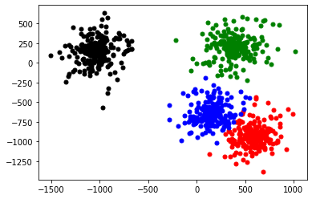

# K-means-with-MapReduce
使用Java + MapRedcue实现 K-means 聚类算法，使用python实现基于散点图的可视化

## 介绍

聚类是针对给定的样本，依据它们特征的相似度或者距离，将其归并到若干个“类” 或“簇”的问题。使用聚类算法能够挖掘数据中潜在的分布规律。K-means 聚类算法是最常用的聚类算法。

本项目使用Java +  MapRedcue 计算框架，实现 K-means 聚类算法并处理给定的数据集(未使用第三方库，例如 MLlib)。同时，用python以散点图的方式对结果进行可视化展示。

输入数据集为当前目录下的kmeans_input文件夹。

## 算法流程

### 第1步 初始化中心点

随机分配簇，初始化中心点，存入HDFS。

利用Mapper读取每一个元素的向量信息，随机赋值，在Reducer中计算中心点信息。由于中心点的计算与迭代时的计算相同，与迭代计算共用一个reducer类。

开启一个Job，初始化中心点的任务配置类，实现一个static方法：

```java
public static void createRandomCenter(String dataPath, String centerPath, int k){
    Configuration hadoopConfig = new Configuration();
    hadoopConfig.setInt("cluster.k", k);
    try {
        Job job = Job.getInstance(hadoopConfig, "random center task");

        job.setJarByClass(KmeansRun.class);
        job.setMapperClass(CenterRandomMapper.class);
        job.setReducerClass(KmeansReducer.class);

        job.setOutputKeyClass(Text.class);
        job.setOutputValueClass(Text.class);

        job.setMapOutputKeyClass(Text.class);
        job.setMapOutputValueClass(Text.class);

        // 输出为新计算得到的center，已存在则删除
        Path outPath = new Path(centerPath);
        outPath.getFileSystem(hadoopConfig).delete(outPath, true);

        //job执行作业时输入和输出文件的路径
        FileInputFormat.addInputPath(job, new Path(dataPath));
        FileOutputFormat.setOutputPath(job, new Path(centerPath));

        //执行job，直到完成
        job.waitForCompletion(true);
        System.out.println("random center task");
    }
}
```

map方法中，根据聚类簇数量，对每个元素赋予随机的类簇序号，作为输出的key。value为元素向量，保持不变。

```java
	protected void map(Object key, Text value, Context context) throws IOException, InterruptedException {
        // 随机分配簇
        int index = (int) (Math.random() * k);
        System.out.println(index);
        context.write(new Text(Integer.toString(index)), value);
    }
```

### 第2步 分配簇，计算中心点

利用Mapper将所有元素与中心点进行对比，分配到最近的簇中。利用Reducer进行求和并计算新的中心点信息。

判断地址属性，对文件夹进行遍历，利用LineReader进行所有文件信息的读取，最终返回二维double集合形式的中心点信息。

```java
    private ArrayList<ArrayList<Double>> centers = null;
    @Override
    protected void setup(Context context) throws IOException, InterruptedException {
        // 读一下centers
        // 地址从配置中拿好了
        Configuration configuration = context.getConfiguration();
        String centerPath = configuration.get("cluster.center_path");
        centers = DataUtil.readCenter(centerPath);}
	在mapper执行前，利用setup方法进行中心点的读取。DataUtil为工具类，readCenter()实现对HDFS中center文件夹中所有文件信息的读取。

	public static ArrayList<ArrayList<Double>> readCenter(String centerPath) throws IOException {
        ArrayList<ArrayList<Double>> centers = new ArrayList<ArrayList<Double>>();

        Path path = new Path(centerPath);
        Configuration conf = new Configuration();
        FileSystem fileSystem = path.getFileSystem(conf);

        if(fileSystem.isDirectory(path)){
            // 文件夹，遍历读取
            FileStatus[] listFile = fileSystem.listStatus(path);
            for (FileStatus fileStatus : listFile) {
                LineReader lineReader = getLineReader(fileStatus.getPath().toString());
                readCenterLines(lineReader, centers);
            }
        }else {
            // 普通文件，直接读取
            LineReader lineReader = getLineReader(centerPath);
            readCenterLines(lineReader, centers);
        }
        return centers;
    }

	protected void map(Object key, Text value, Context context) throws IOException, InterruptedException {
        ArrayList<Double> element = DataUtil.splitStringIntoArray(value.toString());
        // 选择最近中心点，将其作为key
        int index = CalUtil.selectNearestCenter(element, centers);
        context.write(new Text(Integer.toString(index)), value);
    }

```

### 第3步 迭代

1. Mapper中读取数据文件中的每条数据并与中心点进行距离计算，输出key为最近的中心点序号。
2. Reducer中进行归并，计算新的中心点，存入新的中心文件。
3. 判断停机条件，不满足则复制新的中心文件到原中心文件，重复1，2步骤。

```java
    // map读取中心，分类，reduce计算新中心，存储
    // 比较两次中心差距，存储新中心点
    public static void start(String dataPath, String centerPath, String newCenterPath){
        // 设置原中心点
        Configuration hadoopConfig = new Configuration();
        hadoopConfig.set("cluster.center_path", centerPath);

        try {
            Job job = Job.getInstance(hadoopConfig, "one round cluster task");

            job.setJarByClass(KmeansRun.class);
            job.setMapperClass(KmeansMapper.class);
            job.setReducerClass(KmeansReducer.class);

            job.setOutputKeyClass(Text.class);
            job.setOutputValueClass(Text.class);

            job.setMapOutputKeyClass(Text.class);
            job.setMapOutputValueClass(Text.class);

            // 输出为新计算得到的center，已存在则删除
            Path outPath = new Path(newCenterPath);
            outPath.getFileSystem(hadoopConfig).delete(outPath, true);

            //job执行作业时输入和输出文件的路径
            FileInputFormat.addInputPath(job, new Path(dataPath));
            FileOutputFormat.setOutputPath(job, new Path(newCenterPath));

            //执行job，直到完成
            job.waitForCompletion(true);
            System.out.println("finish one round cluster task");
        } catch (IOException | InterruptedException | ClassNotFoundException e) {
            e.printStackTrace();
        }
    }

```

### 第4步 生成聚类结果

输出聚类结果，包括数据点信息与对应簇序号。

开启另一个Job用于生成聚类结果，该方法包括三个参数，分别为数据集地址，中心点地址以及聚类结果输出地址：

```java
	public static void main(String[] args){
        // 命令行参数为数据集名称与聚类数
        String dataName = args[0];
        int k = Integer.parseInt(args[1]);

        String centerPath = DataUtil.HDFS_OUTPUT + "/centers.txt";
        String newCenterPath = DataUtil.HDFS_OUTPUT + "/new_centers.txt";
        String dataPath = DataUtil.HDFS_INPUT + "/" + dataName;
        String clusterResultPath = DataUtil.HDFS_OUTPUT + "/kmeans_cluster_result.txt";

        // 初始化随机中心点
        CenterRandomAdapter.createRandomCenter(dataPath, centerPath, k);
        // 默认1000次，中途停退出
        for(int i=0;i<1000;i++){
            System.out.println("round " + i);
            KmeansAdapter.start(dataPath, centerPath, newCenterPath);
            if(KmeansAdapter.checkStop(centerPath, newCenterPath))
                break;
        }
        KmeansAdapter.createClusterResult(dataPath, centerPath, clusterResultPath);
    }

```

### 第5步 可视化结果

可视化时，首先要读取文件的每一行，并将聚类编号和x y坐标分开，用不同的颜色标识不同的聚类，最后画出来即可，代码如下：

```python
import matplotlib.pyplot as plt
import re

label = []
x = []
y = []
with open('kmeans_cluster_result.txt') as file:
    lines = file.readlines()
    for line in lines:
        arr = re.split(' |\t',line)
        label.append(int(arr[0]))
        x.append(float(arr[1]))
        y.append(float(arr[2]))
        
mark = ['or', 'ob', 'og', 'ok', '^r', '+r', 'sr', 'dr', '<r', 'pr']

for i in range(0, len(label)):
    plt.plot(x[i], y[i], mark[label[i]], markersize = 5 )

plt.show()
```

## 实验结果

经过实验发现，聚类数K=4是最好的。

首先，将输入文本放入HDFS中：

```shell
./bin/hdfs dfs -put ./input /input
```

然后，执行Jar包，其中第一个参数是输入路径，第二个是输出路径，第三个是聚类数：

```shell
./bin/hadoop jar ./hadoop_kmeans-1.0-SNAPSHOT.jar /input /output 4
```

可视化结果如下：



四个质心的坐标位置如下：

```
	581.2483735304816 -930.0778680990376
	149.21612547138778 -642.3408090744012
	386.7612212774783 203.07996261722337
	-1033.107048894814 146.3141243409019
```

部分聚类的结果如下，其中第一列是聚类编号，后两列是坐标：

```
0	201.95839333926213 -610.1614888687657
0	32.01462887825652 -647.6412547780841
0	54.83729999667125 -904.3811344485978
0	242.28608650620268 -377.1755098864822
......
1	-953.0052501621777 32.26020342111498
1	-1073.8591238331912 27.82613875738177
1	-1023.053861943868 157.36024019224365
1	-1016.3805864102071 -55.27811303612242
......
2	492.5590001813256 256.39009060636425
2	89.38694734881466 3.9521397392150845
2	556.8900791907337 83.89276370678998
2	-217.58267720495377 285.0702044786078
......
3	776.397640388748 -1146.8323356276164
3	389.51109535472244 -1167.5703732509387
3	574.3763506986619 -936.2546652885289
3	586.0914857048108 -943.63646399339
......
```

全部的输出结果请看output文件夹。
